# 旅游门户网站-课程设计作品
博客地址：https://oyjcodes.github.io/
## 一、项目背景
```
旅游业作为一个快速成长的服务行业，游客希望获取的旅游资源相比较以往而言更加的多样化。游客需求变化的同时对旅游网站信息化建设的要求也在不断的提高。各地旅游部门为了加快本土旅游业的发展，正在通过各种途径积极探索旅游业发展的新模式。在互联网和电子商务蓬勃发展的大背景下，通过互联网技术建立当地独具特色的旅游门户网站将有效的促进旅游资源的推广。无论是山水风光还是红色旅游资源，江西都具有自身的独特优势。如今旅游业的发展与互联网联系的更加密切，只有加快旅游业信息化发展的步伐，提高旅游业的信息化建设水平，江西旅游产业才能扩大知名度，紧跟信息化时代的发展步伐。传统的旅游服务信息化水平早已无法满足当下用户的多样化需求，管理效率相对低下，数据处理粗糙，信息共享闭塞等问题严重制约着旅游业的发展。旅游网站在整合不同的旅游资源方面具有自身的优势，它可以将以往分散的旅游资源，包括酒店、景区、特产商品等有效的整合分类。网站负责提供全面的旅游信息化服务，用户就不必为寻找不同的旅游资源而花费大量的时间，可以将精力集中用于良好的旅游体验上。这种服务模式在便利了游客出行的同时也实现了旅游资源利用率的最大化。各类服务资源在互补的同时也满足了用户多样化的需求，旅游服务信息化水平的提高在一定程度上会拉动旅游业的增长。利用时下热门的互联网技术打造江西省旅游门户网站，整合江西各大旅游资源。在充分考虑用户使用体验的基础上，实现用户游记发布、特产购买、景点查询等功能。有效提高江西旅游业的信息化服务水平。 
```
## 二、总体设计与实施方案
```
该系统最核心需要解决的问题是如何满足游客出行旅游多样化的需求。旅游业作为一个庞大的服务生态链，它涵盖的服务场景非常广泛。其中包括酒店、景区、交通等各大环节，不同的环节上对应着各自的服务场景。本网站系统最大的作用就是将这些分支服务有效的整合起来，让用户通过一个平台就可以获得各类旅游资源整合后所带来的更加高效、便捷的服务。游客借助这个平台可以更加方便的了解江西独特的旅游文化并且乐于去体验江西旅游资源所带来的旅行服务，从而达到促进江西旅游业发展的目标。
```
### 2.1 系统功能结构
```
根据旅游业的实际业务需求，方便游客对旅游资源的便捷获取并享受其快捷的旅游服务。网站系统采用浏览器、服务器的结构设计。该系统的用户角色分为：游客、会员、网站管理员。该系统分为前台的用户模块、后台的管理员模块。用户模块如下：发布游记、发表评论、点赞游记、特产预定、个人信息管理、用户注册、网站信息预览。管理员模块如下：订单管理、景区管理、特产管理、酒店管理、首页信息发布管理、游记管理、评论管理、用户管理。
```


### 2.2 功能描述
#### 前台模块

```
（1）用户签到：用户每天可签到一次得20积分，且一天只能签到一次，可以查询到不同的积分值对应不同的奖励实施方案。

（2）用户注册：用户在前台输入有效的信息，包括用户手机号以及邮箱等信息。然后通过接入第三方平台的短信验证、邮件激活用户状态等几个关键操作，用户才完成注册成为会员的操作。

（3）用户登录：只有当用户账号处于可用状态时，该用户才可以成功登录进入系统。

（4）用户个人信息设置：用户可以修改自己的头像图标、登录密码、地址等个人信息。

（5）发布游记：用户可以将自己旅游心得通过图片或文字的形式发布到网站上，与广大的驴友分享旅途的快乐。

（6）发表评论：已注册用户可以对审核通过的游记发表自己的评论以及对景点、特产、酒店发表自己的评论。

（7）点赞游记：已注册用户可以对自己喜欢的游记进行点赞操作，对应的游记点赞数目加一。

（8）下订单：登录用户可以对自己喜欢商品进行购买，完成下订单的操作并且对订单进行在线付款。

（9）前台搜索：用户可以对江西省各个地级市的特产、美景、资讯、酒店进行分类的模糊查询。

（10）个人订单管理：用户可以在自己的个人主页查询自己下单情况并且可以对未付款的订单进行删除操作。

（11）个人游记管理：用户可以对已经发表的游记进行删除或修改操作以及查看每个游记的点赞情况和评论信息。

```
#### 后台模块

```
（1）管理员登录：管理员只有在个人信息得到有效的验证后才可登录网站后台系统。 

（2）订单图表统计：用户可以通过折线图和柱状图对江西省各个地级市下订单的数量以及营业金额进行统计显示，对形成的图形可以下载生成图片格式进行保存，便于管理员对数据进行分析。

（3）网站首页信息发布管理： 该功能模块可以实现广告管理、资讯管理、特产管理、景区管理。广告管理和资讯管理模块可实现广告和资讯的发布操作并在首页进行分类展示，可以对已经发布的广告和资讯信息进行修改并重新发布，可以对选中的广告和资讯信息进行上下架处理。特产管理和景区管理可以对已发布特产和景区信息进行修改操作，对特产和景区的状态进行上下架处理。

（4）景点管理：可以分页显示所有的景点信息并且可以在搜索栏内输入地级市的名称进行各个地区的景点查询。实现点击发布按钮可将景点发布到首页的江西美景模块，可对景点信息进行修改和批量的上架、下架操作，点击新增景点可以发布新的景点信息。

（5）特产管理：可以分页显示所有的特产信息并且可以在搜索栏内输入特产名称实现特产的精确查询。实现点击发布按钮可将特产发布到首页的江西特产模块，可对特产信息进行修改和批量的上下架操作，点击新增特产菜单项可以发布新的特产信息。

（6）酒店管理：可以分页显示所有的酒店信息并且可以在搜索栏内输入酒店名称实现酒店信息的精确查询。可对酒店信息进行修改和批量的上架、下架操作，点击新增酒店选项可以发布新的特产信息。

（7）游记管理：可以分页显示所有的游记信息并且可以在搜索栏内输入用户的账号来查询显示该用户已发布的所有游记信息。管理员可对游记进行单项或批量的审核操作判断游记是否可以通过审核，游记的状态栏应该用不同的字体颜色显示通过或待审核状态。

（8）评论管理：该功能分为景点评论、特产评论、酒店评论、游记评论。管理员可以对这些评论进行撤回或通过的权限管理。在游记评论模块，可以根据用户编号来查询该用户已发布的评论信息。

（9）订单管理：可以根据用户名查询该用户的所有的下单信息，并可对某一个订单信息进行详细的查询。

（10）用户权限管理：可以查询所有的用户信息以及在搜索框中输入用户名来查询某一个用户的具体信息，实现对用户权限进行管理。

```

### 2.3 实施计划
```
本系统的实施计划按以下五个阶段依进行划分，依次为前期的需求调研分析阶段、模块概要设计阶段；中期的功能模块详细设计阶段、模块编码实现阶段；后期的系统测试修改阶段。
```
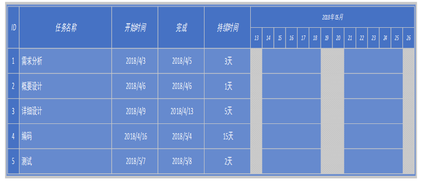

```
（1）在需求分析阶段，结合各大旅游门户网站的优势与江西旅游资源自身的特点，对项目的功能点进行分析并撰写详细的需求分析文档。

（2）在概要设计阶段，依据需求文档划分功能模块，对数据库模型进行设计，分析系统的结构关系与对应的层次。

（3）在详细设计阶段，对功能模块描述进行结构化设计，完成详细的流程图以及数据库设计与界面设计，撰写设计说明书。

（4）在编码阶段，首先按不同的模块层次进行划分，然后搭建项目开发框架，编写功能接口并实现面向接口的开发。

（5）在测试阶段，首先对同一类模块下的小功能点进行单独测试，通过后再进行单元模块的整合。各模块测试通过后再对模块间的接口进行测试，最后整合系统进行整个系统测试。

```

### 系统角色

#### 普通用户

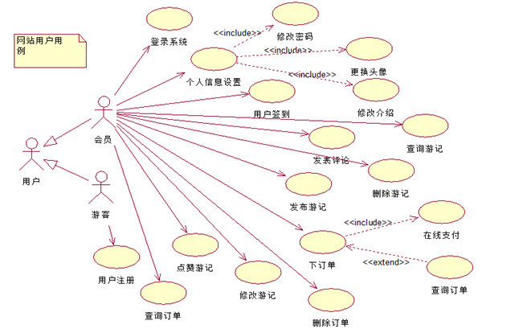

#### 管理员
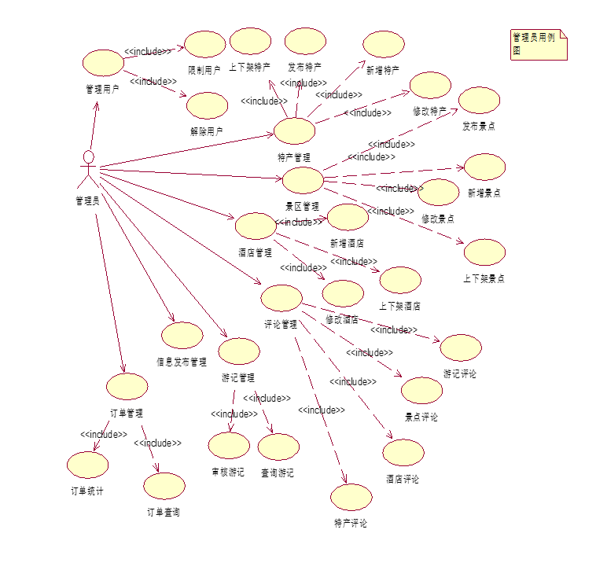

## 三、数据库设计

```
本网站系统使用的是MYSQL数据库，依据E-R图转化为关系模型的原则，得到的关系模型如下：

订单（订单编号，用户编号，特产编号，特产名，订购数量，单价，总价，订单状态，下单时间）

游记（游记编号，用户编号，点赞数，游记标题，描述，图片，状态，发布时间）

资讯（资讯编号，资讯标题，发布时间，图片，描述，状态）

广告（广告编号，广告标题，子标题，图片，描述，发布时间，状态）

景点（景区编号，区 域 编号，景区地址， 咨询电 话， 景区名称，标题，类型，开放时间，图片，视频地址，门票费，景区描述，状态）

特产（特产编号，特产地编号，特产名称，特产类型，图片，库存量，特产价格，特产描述，状态）

酒店（酒店编号，名称，区域编号，地址，酒店电话，酒店描述，酒店图片，酒店价格，状态）

评价（自增编号， 会员账号， 商品编号， 评价内容， 评价商品类别， 评价时间）

区域（区域编号，区域名，区域描述）

管理员（管理员编号， 管理员姓名，密码， 电话）

用户（手机号，昵称，激活码， 性别， 地址， 签名， 用户头像， 状态，邮件， 生日， 用户密码）

```

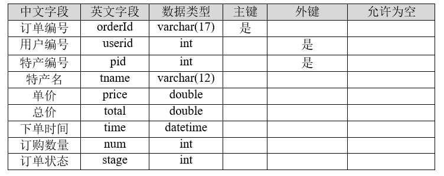


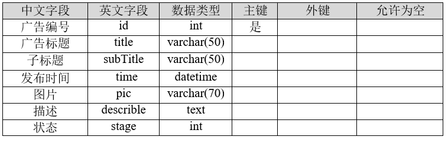

..........等数据表，（😀Tip:具体的数据表生成语句sql已被上传到项目中,方便需要的小伙伴们学习使用，小伙伴们别忘了给个小星星，谢谢啦🥧)

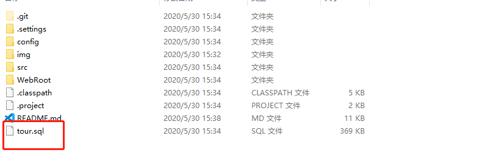

## 四、系统实现

```
旅游网站系统的实现充分结合了时下热门的电子商务模式，通过网站的特产商城模块将旅游服务与电子商务完美的融合在了一起。特产营销不仅会带动当地旅游收入的增长，而且特产的销售本身就是对当地旅游资源的一种宣传方式。在网站的特产商城模块，用户可以依据自己的喜好选择相应类别的特产进行购买。在订单支付模块，系统接入了第三方支付平台，用户可以选择不同的支付方式对订单进行在线付款操作。在这种模式下，用户可以方便的对特产商品进行购买。在后台订单统计模块，实现对江西省各个区域的订单情况进行统计分析，包括订单数量和订单金额。利用Echarts可视化图形插件对查询的订单数据进行柱状图和折线图的可视化显示。为了最大程度的激活旅游网站的活力，为此设计了游记发布功能，在游记发布平台上用户可以实现游记的发布操作，用户通过在平台上发布图片和文字的方式表达自己的旅游心得，其他用户也可以对发表的游记进行评论操作。通过这种方式可以有效的激发网站的在线用户活力，鼓励更多的游客前往江西旅游，进而推动江西整个旅游产业的蓬勃发展。
```
### 4.1 首页功能模块

```
网站首页设计简约大方，首页主要分为江西美景、江西特产、大话江西、新闻资讯四大模块，首页界面如图所示,在轮播图部分使用了江西久负盛名的名山作为轮播展示的图片，以此宣传江西的名山文化。
```

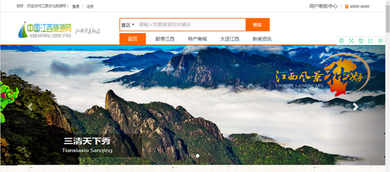

### 4.2 用户注册模块

```
用户注册要求使用手机号进行注册，功能的实现使用了Ajax请求调用sendSMS方法。该方法调用短信接口平台，实现注册短信验证码的发送与数据校验。通过邮件服务器实现用户激活邮件的发送，通过邮件激活用户状态后完成注册。注册界面如图所示：
```
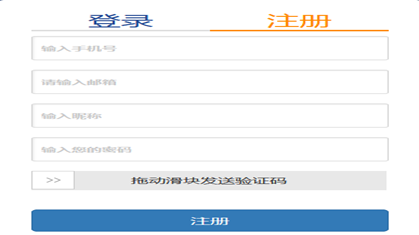

#### 注册流程
```
1）点击注册按钮实现用户信息的注册。后台register方法会校验如下几个方面：用户是否选择发送了短信验证码；输入的短信验证码是否与短信平台发送的短信验证码一致；该手机号是否已经被注册过。若以上的条件都满足，系统会向用户的注册邮箱发送一封激活邮件。只有通过邮件激活后该用户身份才有效，否则无法登录系统，注册的流程图如图所示：

2）在注册页面上滑动滑块到进度条顶端时，前台首先会验证手机号码格式是否正确。若手机号码格式无误，前台则会通过Ajax请求后台处理短信发送的sendSMS方法，并将注册页面文本框中输入的手机号码作为参数传入到sendSMS方法。该方法会去调用短信接口，让短信平台发送注册验证码到前台注册的手机上。
```
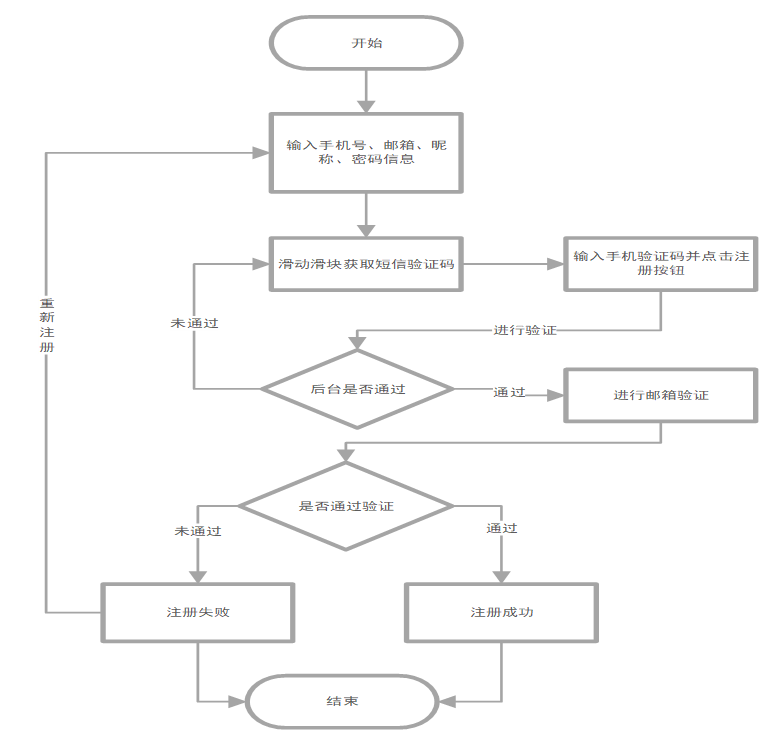

### 4.3 发布游记模块

```
1）用户登录成功后在个人主页点击发布游记，会显示文本框和图片上传工具栏。用户填写相应的描述信息以及选中需要上传的图片，点击发布按钮将游记信息通过表单提交给后台uploadTravel方法，实现游记的发布。如图所示：

2）为实现发布游记的功能，其核心是如何解决多图片上传的问题。为了提高图片的读取效率，将图片的路径保存到数据库中并配置相应保存图片文件的磁盘路径，实现的伪代码如下：
Begin(算法开始)
   获得前台上传的图片保存进入->MultipartFile[] files数组中
        IF (图片数组files不为空) {  
           FOR(循环遍历files数组得到单个图片->file) {            
                if (file不为空) {
                    获得原始文件名：originalFile，
                    根据UUID随机生成新的序号并与originalFile图片后缀拼接生成新的文件：newMyFile， 
                    设置文件将要保存的新路径：pathRoot ，
                    根据新图片名和保存路径创建新图片：saveFile ，
                    将新的图片数据保存进磁盘中
                }
            }
        }
End (算法结束) 

```
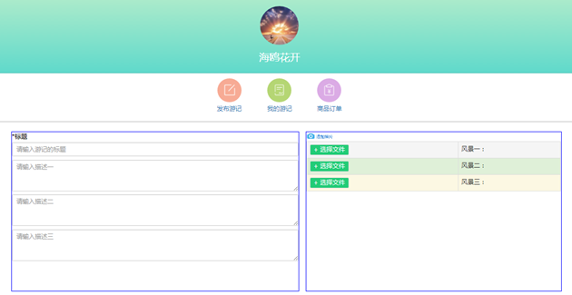

### 4.4 特产商城模块

1）该页面无需登录便可访问，特产商城首页主要展示江西各个地方的美食、特产。对应在每个商品项一栏显示的是特产商品名称、商品价格。用户可以点击查看详情选项来查看某一项特产的具体信息。在页面的右侧分别是玩在江西、吃在江西、住在江西推荐模块，如图所示：

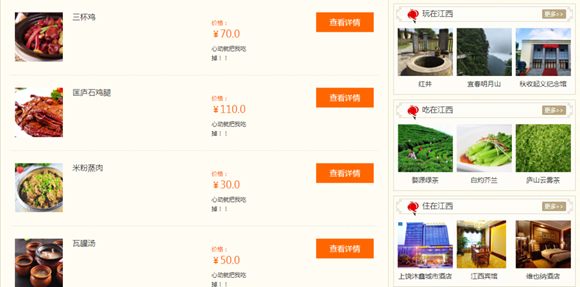

2）通过点击查看详情按钮，前台会将特产商品的id值作为参数传入后台的getSpecialty方法。该方法查询特产的详细信息如下：特产的图片信息、特产名称、特产库存数量、特产单价以及所有用户对该特产的评价信息。并将这些特产信息传递到specialty页面进行显示，特产详情展示如图所示：


3）前端采用Get请求方式，将特产编号id以及特产所在地区域编号areNum作为参数传递到后台getSpecialtyController。该方法返回特产的详细信息、特产所有的评论信息、特产所在地的其它特产信息。查询特产的模块组件及工作过程如图所示：

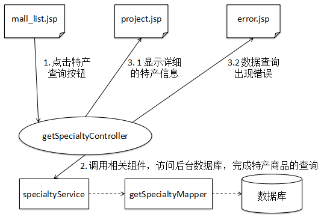


### 4.5 订单模块

1) 用户点击购买特产商品时会调用后台的giveOrder方法。系统会根据用户选择的特产信息以及订购的特产数量，计算出此次购物需要支付的金额并生成对应的订单。订单页面如图所示：

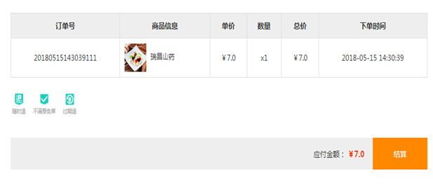

2）用户点击结算按钮调用后台的getPayController方法，该方法调用Service层的orderService方法，将用户的订单信息保存进数据库中的order表中并设置该订单状态为“未付款状态”。订单录入模块组件及工作过程如图所示：

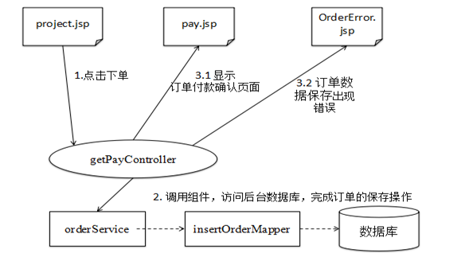

3）在线支付功能作为订单创建步骤中最重要的一个环节，当用户确认订单无误便可以进行付款操作。首先会调用后台的giveMoney方法去连接第三方支付平台，支付平台根据用户选择的银行跳转到对应的银行支付页面，用户在该页面完成支付，如图所示：

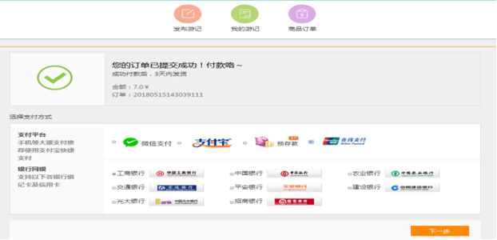

4）订单的支付流程如图

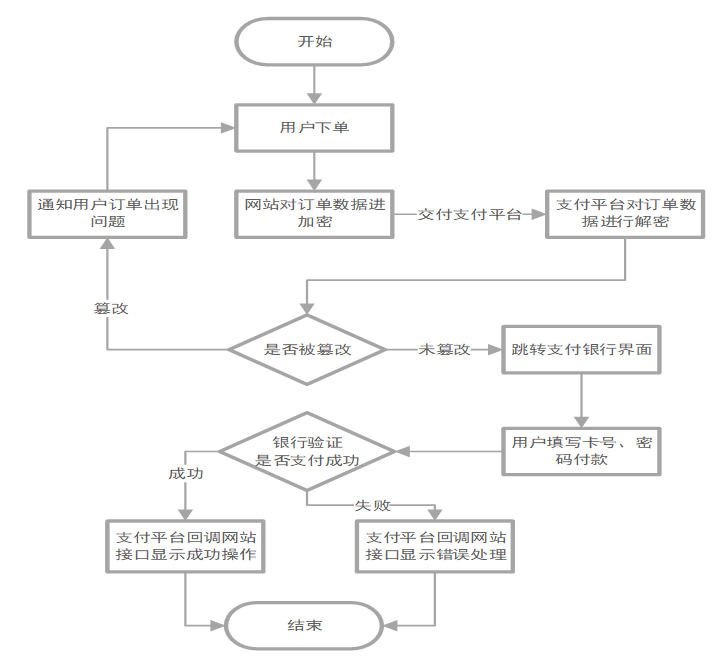

5）可以在我的个人主页查询到自己的全部订单信息，订单列表信息如图所示：

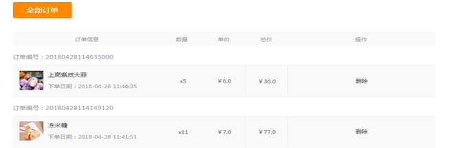


### 4.6 个人信息设置模块

1）修改基本用户信息。用户首先在表单里输入要修改的用户信息，包括昵称、居住地址、个性签名。点击保存按钮后前台会检验表单是否有空项，若没有空的表单项则调用后台updateText方法去修改用户表中该用户的信息。

2）修改用户登录密码。用户输入的新密码不能和原密码一致且再次输入的新密码必须和第一次输入的新密码一致，此时才会调用后台updatePassword方法。

3）修改用户头像。用户首先点击“选择文件”按钮选择要上传的头像图片，确认图片上传会调用后台的updateImage方法，上传的图片支持jpg、png、jpeg等图片格式。

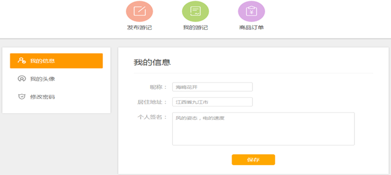

### 4.7 后台景点管理模块

景点管理模块用于管理员对江西各个区域的景点信息进行如下管理：修改、删除以及新增景区信息、将景区基本表中的景点信息发布到首页以供展示、按地区编号分页查询各地的景区信息、对已发布的景点进行批量上下架操作，景区管理页面如图所示：

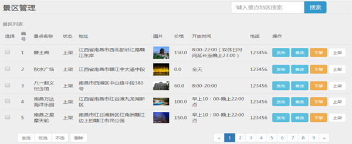


1）修改景点信息。每一个景点的基本信息量大，管理员向数据库景点表中录入景区信息时难免会发生录入信息出错的情况。借助这个修改功能，管理员只需填写需要修改的表单信息，点击提交即可。景点修改页面如图所示：

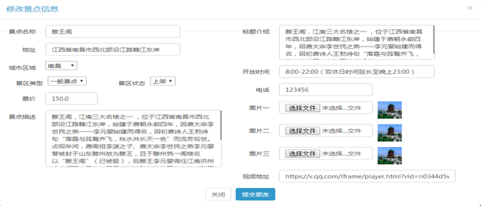

2）景点修改模块组件及工作过程如图：

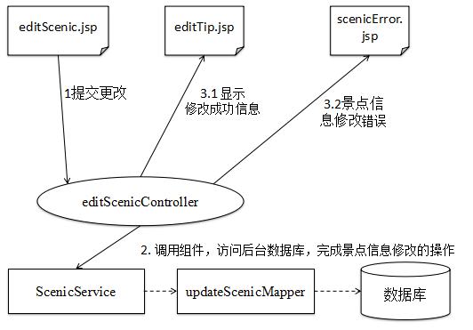

3）新增景点信息，此功能可以实现将景点信息发布到景点数据表中。管理员只需在表单中填写景点的信息后进行提交操作,后台的addScenicController方法会调用service层的insertScenic方法，向景点表中添加新的景点信息，如图所示：

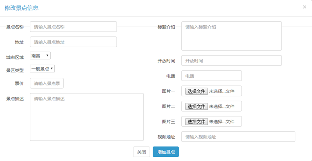

4）查询景点信息，管理员可以在搜索框中输入某一个区域名进行查询，前台将输入的区域名作为参数，通过Get请求调用后台的getAllScenicByAreaName方法，查询该区域所有的景点信息并且设置每页需要显示的数据条数，进行分页显示，如图所示：

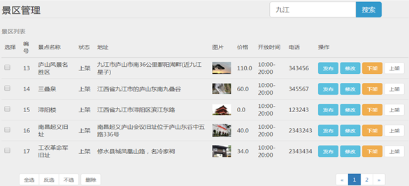

 5）发布景点信息。管理员可以选中某些景点进行发布操作，发布的景点会在前台首面进行展示，如图所示：

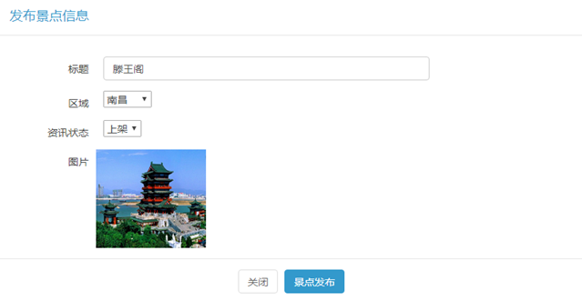

### 4.8 订单数据可视化模块

随着用户下单数量不断的增多随之而来会产生大量的订单数据。为了更好的对这些订单数据进行查看和统计，需要对这些数据进行进一步的处理，转化为图形显示是最好的选择，折线图、柱状图：

为了对订单数据进行可视化的展示，这里使用了一款百度的Echarts插件。通过Ajax请求后台getOrderController方法，得到不同地区对应的下单数量以及订单总额，将其转化为json格式的字符串后返回到前台，通过Echarts插件显示出来。订单统计模块组件及工作过程如图所示：


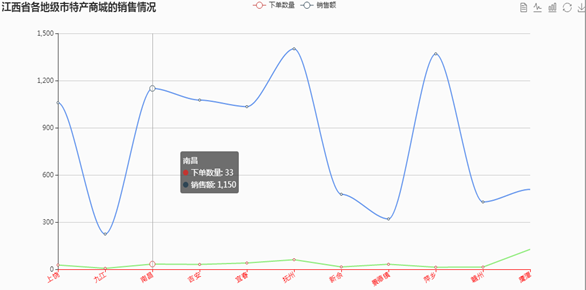

### 4.9 游记管理模块

前台用户发布的游记也许会涉及到一些不合法的信息。该功能主要是对用户发表的游记进行审核，只有审核通过的游记才可以被其他用户所见，否者只有发布者自己可见，界面如图所示：

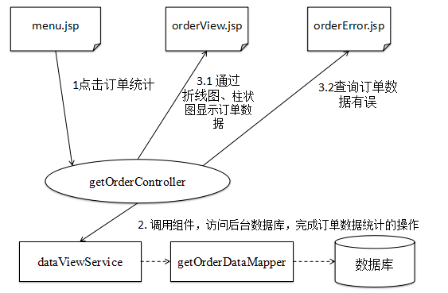

1）用户游记搜索。为了对用户发表的游记进行方便的管理，可以在搜索框中输入用户名进行搜索。前端将用户账号作为参数，通过Get请求方式调用后台的getAllTravlesById方法，通过该Controller方法去调用Service层的backTravelsService方法查询该用户发布的所有游记信息并返回到前台travel.jsp页面。

2）游记审核功能。此功能为了方便管理员对发布的游记进行审核，只有被审核通过的游记才可以在游记模块被正式发布。管理员点击某一个游记的“通过”按钮，前台将该游记的id作为参数，通过Get请求方式调用travelPass方法，该方法会修改游记表travel中的该项游记为“审核通过”状态。


### 4.10 用户管理模块

用户管理功能方便管理员对系统用户进行权限的分配管理，可以查询所有的用户信息以及按用户名查询某一个用户信息，界面如图所示：

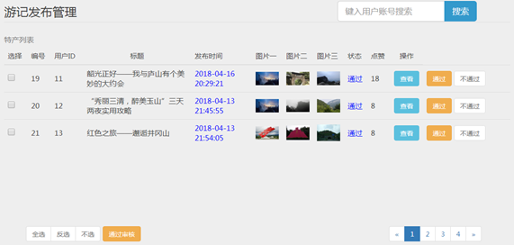


## 系统调试与分析

该网站系统开发过程中遇到了许多问题，通过借助于Eclipse和浏览器的开发工具进行断点调试，定位到问题代码段进行分析解决。对于开发阶段暂时没有发现问题的功能模块，就需要在测试阶段借助一定的测试方法对功能模块进行测试。为此对网站系统开发过程中遇到的典型问题和花费很大精力解决的问题做出以下的总结：

1）因为该网站系统涉及到大量的图片上传，为了提高图片的存储及读取效率，选择将图片的路径保存到数据库中，前端通过读取数据库中的存储路径去显示图片。后来发现在重新启动服务器之后，之前上传的图片无法在页面上显示出来，去保存图片的文件夹下面看发现之前上传的图片都消失了。经过查阅资料和分析问题才发现图片保存路径有问题，不能将图片保存到Tomcat服务器的webapps下。只要服务器每一次重新启动，在该路径下保存的图片都会被重新的覆盖掉。解决方法如下：对图片的保存地址路径进行虚拟映射配置，即在server.xml文件进行修改如下：将图片上传的路径保存到E:\image\temp目录下，将pic作为此目录的虚拟目录。

2）在发布评论模块，因为提交评论后需要查询更新后的评论信息显示在评论区，此时使用表单形式提交后页面会停留在首部，不会停留在页面底部的评论区。这对用户进行评论时的体验非常的差。为了解决这个问题考虑使用jquery中的ajax进行页面的局部刷新。

3）在订单购物模块，未登录的用户点击下单操作，登陆后进入系统回到的是网站的首页，无法回到之前的下单页面。解决方法如下：在框架中的配置文件下配置拦截器
 

4）在使用Echarts插件时，后台的数据总是无法在前端的柱状图和折线图中显示，后来在浏览器上打开开发者模式，观察从后台返回的json字符串数据格式并不满足该插件的格式，解决方法如下：将查询到的list数据按地域名、对应的订单数量、订单金额分别循环遍历取出存储在map当中，并且使用@ResponseBody将map转化为json字符串格式返回到前端。
 

5）在后台的景区管理模块实现景点的批量下架时，景点的状态未变为下架状态，即下架操作没有成功。检查代码发现在checkbox的选中循环遍历时出现错误，使得景点id未全部传递到后台Controller方法中，解决方法如下：在后台scenic.jsp页面将类型为checkbox的input标签设置相应的class属性。在js中对该类属性的checkbox元素进行选中的循环遍历，赋值到一个数组中并通过ajax方法传递到后台。

## 总结

🍉该系统适合掌握了SSM框架基础的同学，该系统架构简单，没有运用复杂的中间件，对于第一次搭建框架到完成各个功能模块的编码，势必可以为同学们今后的编程之路打好实践基础。这也是本人从jsp到SSM的第一次过度，现在回顾虽说不难，但是踩过的坑的确让自己学会了独自解决问题的能力，其中有些设计和编码现在看来难免有些不合适🙇🙇🙇，毕竟人都在成长嘛😳😳😳，掌握知识的广度和深度都不一样。最后，💪💪💪💪💪祝福仍在coding道路上奔跑的我们!!!!!


